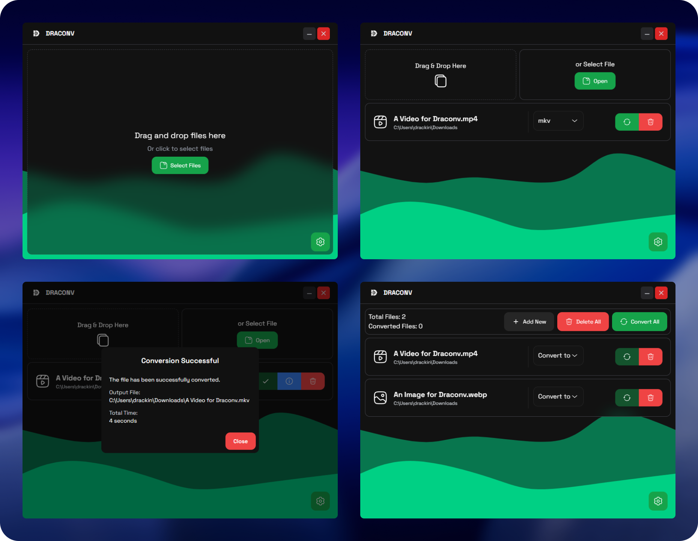

<div align="center">
    <br>
    
    <h1>Draconv (Beta)</h1>
    <p>A modern, fast and open-source file converter.</p>
</div>


# 🔁 Draconv
### A cross-platform, modern, simple and fast file converter.

### ⚡ Powered by [FFmpeg](https://ffmpeg.org/), [Tauri](https://tauri.app/), [Nuxt 4](https://nuxt.com/)

## ✨ Features

- 💻 **Cross-platform**: Works on Windows, macOS, and Linux.
- 💨 **Fast Conversion**: Utilizes the power of [FFmpeg](https://ffmpeg.org/) for efficient video processing.
- 🪶 **Minimal UI**: Clean and user-friendly interface. No unnecessary clutter.
- ⬇️ **Drag and Drop**: Easily add files by dragging and dropping them into the app.
- ⚙️ **Customizable Settings**: Adjust conversion settings to fit your needs.
- 🌆 **Lossless Conversion**: Preserve the original quality of your videos.
- ⚡ **Hardware Acceleration**: Leverage your GPU for faster conversions (if supported).
- 🍀 **Open Source**: Fully open-source.
<!-- - **Batch Processing**: Convert multiple files at once. -->

## 📷 Screenshots


## ⬇️ Download

| **Platform** | **Download Link** |
|--------------|-------------------|
| Windows      | [.exe, .msi](https://github.com/Drackin/Draconv/releases/latest) |
| MacOS        | [.dmg, .app](https://github.com/Drackin/Draconv/releases/latest) |
| Linux        | [.deb, .rpm, .AppImage](https://github.com/Drackin/Draconv/releases/latest) |

> [!WARNING]
> ### Windows SmartScreen Warning
> You may see "Windows protected your PC" warning because the app is not code-signed yet and also the app has a few downloads. Windows SmartScreen may warn you about running the app. Click on ***"More info"*** and then ***"Run anyway"*** then the app will run normally.

> [!WARNING]
> ### MacOS Gatekeeper Warning
> Same as Windows, MacOS may warn you about running the app because it is not code-signed yet (requires an Apple Developer account).
> If you see ***"Draconv is Damaged"***, open a terminal and run the following command:
> ```bash
> xattr -cr /Applications/Draconv.app
> # or try quarantine removal if the above doesn't work
> xattr -rd com.apple.quarantine /Applications/Draconv.app
> ```

Get the latest release from the:
### [Releases page](https://github.com/Drackin/Draconv/releases/tag/alpha)

## ⌛ Incoming Features
- [x] Multiple files at once
- [ ] AI Video Upscaling. (Just Thinking)
- [ ] Logging: View detailed logs of conversion processes in a file
- [ ] Better file handling (temporary file until done, select save location, etc)
- [ ] More output formats
- [ ] More UI improvements
- [ ] More conversion options
- [ ] More input/output settings
- [ ] More options at settings
- [ ] Multiple language support
- [ ] CLI support
- [ ] Useful shortcuts
- [ ] Notifications
- [ ] Conversion History
- [ ] Presets for conversion settings
- [ ] Theme support
- [ ] Preview files before conversion
- [ ] Reorder files in the queue

## 🪲 Known Issues
- [Linux Error with AppImage] Could not create default EGL display: EGL_BAD_PARAMETER. Aborting... (Tauri issue?)

***Made with Tauri*** ❤️

This project is licensed under NPOSL-3.0 — see LICENSE for details.