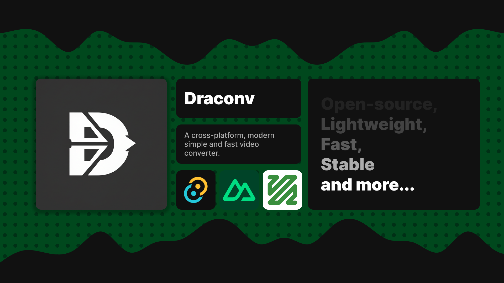
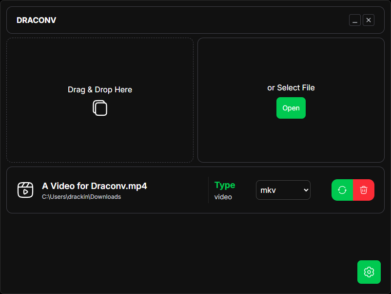
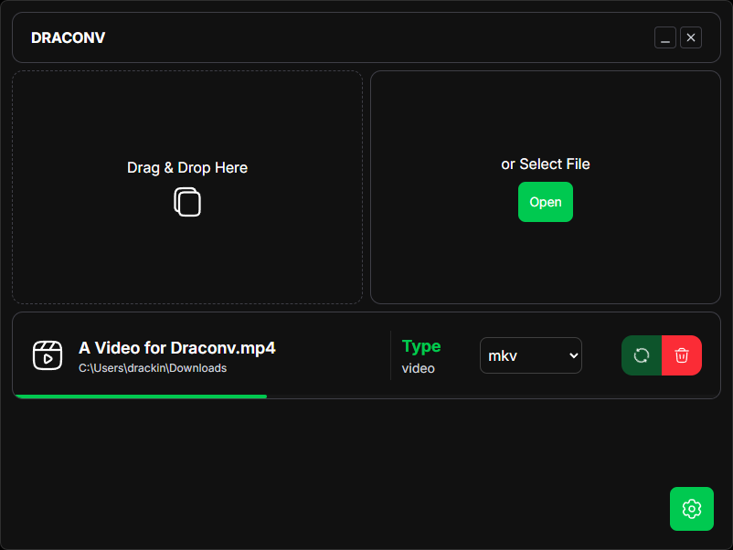
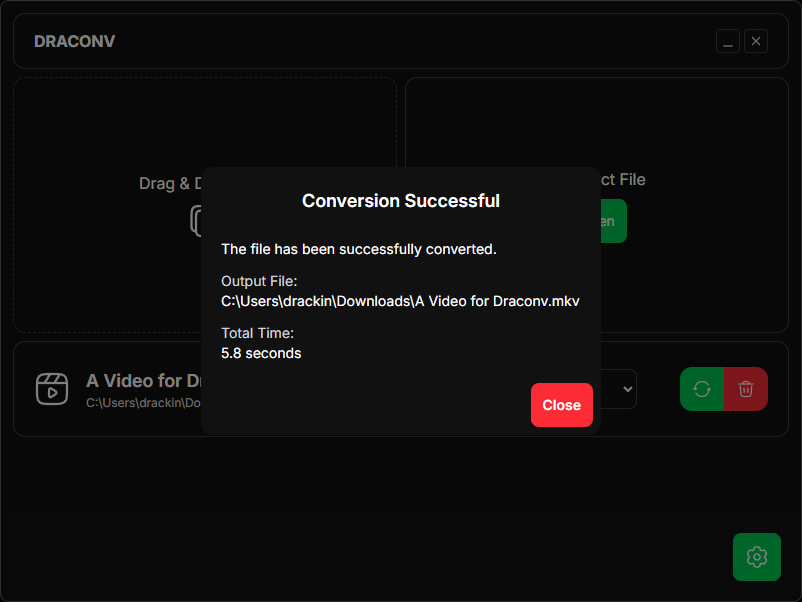

## ⚠️ WARNING: THIS VERSION IS A PRE-ALPHA. IT MAY CONTAIN BUGS AND MISSING FEATURES. ⚠️
⚠️ **NOT FULLY TESTED IN ALL PLATFORMS.** ⚠️

# 🔁 Draconv
### A cross-platform, modern, simple and fast video converter.

### ⚡ Powered by [FFmpeg](https://ffmpeg.org/), [Tauri](https://tauri.app/), [Nuxt 4](https://nuxt.com/)

## ✨ Features

- ⚠️ (WORKS FINE ON WINDOWS) 💻 **Cross-platform**: Works on Windows, macOS, and Linux. ⚠️ (Full test only for Windows. I'll test the others later) ⚠️
- 💨 **Fast Conversion**: Utilizes the power of [FFmpeg](https://ffmpeg.org/) for efficient video processing.
- 🪶 **Minimal UI**: Clean and user-friendly interface. No unnecessary clutter.
- ⬇️ **Drag and Drop**: Easily add files by dragging and dropping them into the app.
- ⚙️ **Customizable Settings**: Adjust conversion settings to fit your needs.
- 🌆 **Lossless Conversion**: Preserve the original quality of your videos.
- ⚡ **Hardware Acceleration**: Leverage your GPU for faster conversions (if supported).
- 🍀 **Open Source**: Fully open-source.
<!-- - **Batch Processing**: Convert multiple files at once. -->

## 📷 Screenshots

## ⬇️ Download
Get the latest release from the [Releases page]

## ⌛ Incoming Features
- AI Video Upscaling. (Just Thinking)
- Multiple files at once.
- Logging: View detailed logs of conversion processes in a file.
- Better file handling (temporary file until done, select save location, etc).
- More output formats.
- More UI improvements.
- More conversion options.
- More input/output settings.
- More options at settings.
- Multiple language support.
- CLI support.
- Useful shortcuts.
- Notifications.
- Conversion History.
- Presets for conversion settings.

## 🪲 Known Issues
- Not tested on macOS.
- No fully tested Linux support.

***Made with Tauri*** ❤️